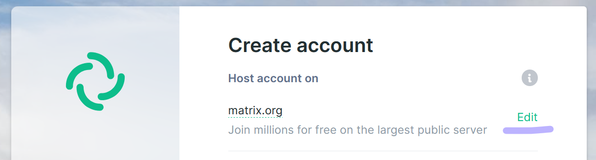
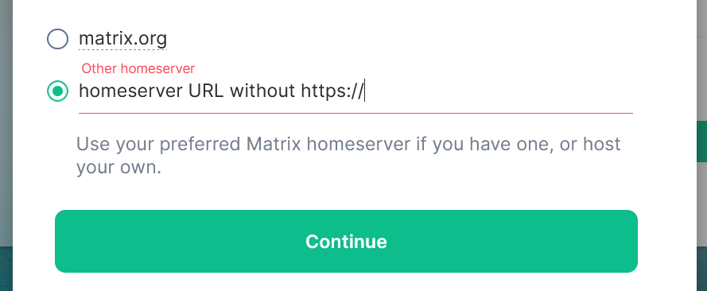
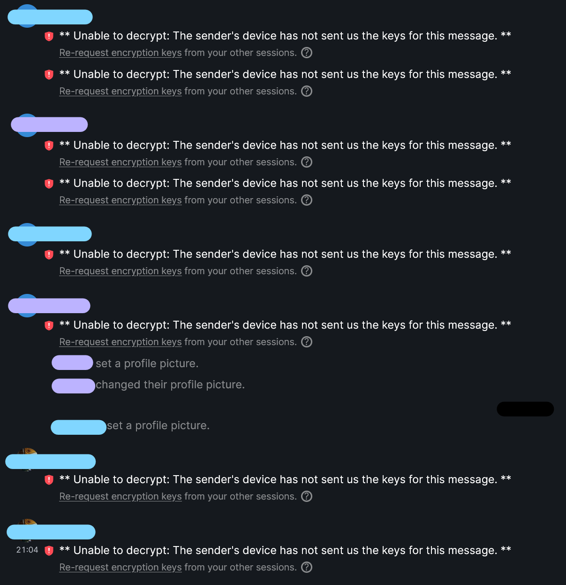

# Matrix [de]

## Wieso weshalb warum?

- sicher
- nicht an telefon oder tel-nummer gebunden
- föderiertes netzwerk

<br/>

## Ersteinrichtung

Ich werde hier die schritte für element beschreiben. Es gibt aber auch andere gute clients, zB SchildiChat (basiert auf element) und FluffyChat (minimalistischer). 
WICHTIG: 
- matrix != element
- kein matrix.org account machen

1. [Element herunterladen](https://element.io/get-started) bzw [element web](https://app.element.io/?pk_vid=1624108555452221) öffnen
2. Account bei einem Homeserver erstellen der NICHT matrix.org ist

    2.1: Edit klicken
    

    2.2: Homeserver URL Eintragen
    
3. Keys einrichten (weitere Infos in bei [Verschlüsselung](#verschlüsselung))

Grundsätzlich würde ich von einem Matrix.org Account abraten, weil ein großer Vorteil von Matrix Dezentralisierung ist. Dein Account ist bei einem kleineren Server besser aufgehoben. 

Nun Fragst du dich vielleicht welchen Homeserver du statt matrix.org nehmen solltest. Hier habe ich mal einige aufgelistet, nimm einen der sich angenehm anfühlt. Die Software (synapse) die drauf läuft ist bei allen gleich.

<br/>

### Öffentliche Server

- Infoseite | ```Homeserver URL``` # Notizen
- [fairydust.space](https://fairydust.space/) | ```fairydust.space``` # [CCC](https://www.ccc.de) nah
- [envs](https://envs.net/) | ```envs.net``` # [CCC Dresden](https://c3d2.de/) nah
- [tchncs](https://tchncs.de/matrix) | ```tchncs.de``` # sehr zuverlässig
- [privacytools](https://www.privacytools.io/services/chat/) | ```privacytools.io``` # etwas groß

#### Tech Kollektive / Inis

- [feneas](https://chat.feneas.org/) | ```feneas.org```
- [activism.international](https://activism.international/#what-is-activisminternational) | ```activism.international``` # [EG](https://www.ende-gelaende.org/) nah; erst [SSO Account](https://cloud.activism.international/apps/registration/) erstellen, dann im matrix client anmelden
- [systemli](https://www.systemli.org/en/service/matrix/) | ```systemli.org``` # freundlich fragen :)
- [systemausfall](https://systemausfall.org/dienste/matrix) | ```systemausfall.org``` # freundlich fragen :)
- [fff.chat]() | ```fff.chat```

#### Ungeprüft

Einzige kriterien sind 100% uptime, eine aktuelle version und kein oder ein großes upload limit. Ich habe aber kein account hier. Probiert sie aber mal aus und sagt bescheid ob die gut sind:

- [nitrokey chat](https://www.nitrokey.com/products/nitrochat) | ```nitro.chat```
- [asra.gr](https://wiki.asra.gr/en:start) | ```asra.gr```
- [freifunk südholstein](https://freifunk-suedholstein.de/freitrix-freier-datenschutzfreundlicher-messenger/) | ```freitrix.de```

Keine Infos (uptime, version, upload limit) gefunden
- [untanga riot](https://riot.untanga.org/) | ```untanga.org``` # run by a person from https://systerserver.net/

<br/>

## Verschlüsselung

1. Security key einrichten
2. SICHER (ohne dass andere rankommen, aber so, dass du IMMER rankommst) abspeichern, zB in einem sicheren Passwortmanager wie [Bitwarden](https://bitwarden.com)
3. KEY NICHT VERLIEREN!

Wenn der key fehlt, können alte (verschlüsselte) Nachichten nicht entschlüsselt werden.



### Sinnhaftigkeit von Verschlüsselung

Privatchats sollten immer verschlüsselt werden. Sensible, invite only Gruppenchats auch.
Öffentlich Gruppen zu verschlüsseln ist absoluter quatsch. In verschlüsselten chats funktionieren viele AppServices nicht (zB poll-bot oder die telegram-bridge).

<br/>

<br/>

## Feedback / Input
- verschlüsselung, keys, verifizieren, WTF
- FFF: sso = einmalanmeldung
