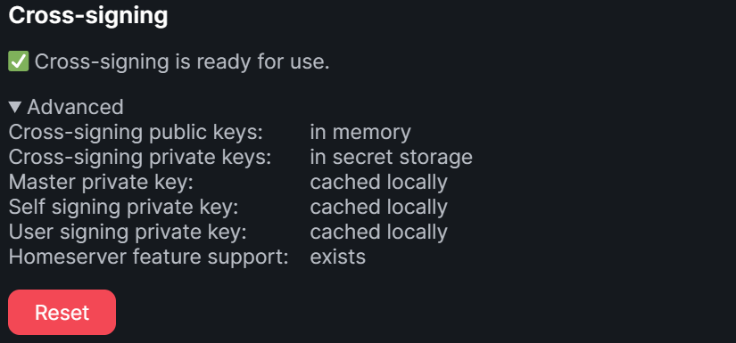
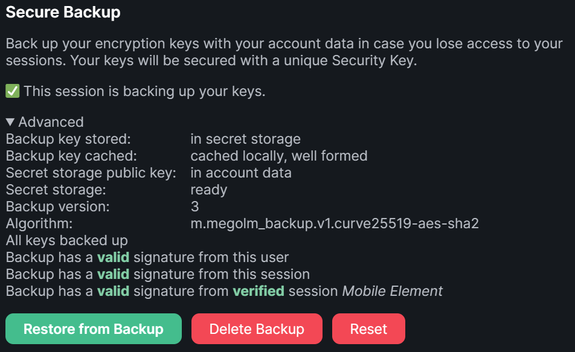
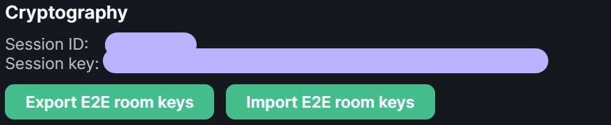
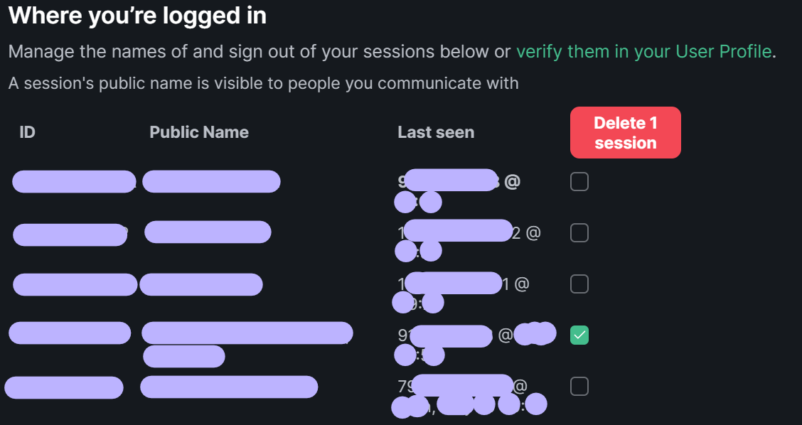

# Matrix [de]

Inhalt:

- [Generelles](#Generelles)
- [Ersteinrichtung](#Ersteinrichtung)
  - [Öffentliche Server](#Offentliche-Server)
  - Tech-Kollektive / Inis
- [Verschlüsselung](#Verschlusselung)
- [Einrichtung auf Smartphones](#Smartphones)
  - Android
  - IOS
  - [Kein Speicherplatz?](#Kein-Speicherplatz)

<br/>

## Generelles

**Matrix != Element.** Das führt verständlicherweise oft zu Verwirrung. Matrix ist das Protokoll, also wie Nachichten versendet werden. Es gibt aber viele clients womit das protokoll benutzt wird, zB Element, Fluffy, Schildi und nheko. Kein Mensch sagt "ich schick dir 'ne thunderbird nachicht" sondern es wird von eMail geredet, also dem Protokoll und nicht dem client. Mit Matrix ist also das protokoll gemeint, mit Element der client.

[...über Matrix und Element](https://www.kuketz-blog.de/element-messaging-ueber-die-matrix-messenger-teil7/).

Zum Warum: [ein Vergleich mit anderen Messengern](https://blog.decided.to/25576/messengerdebatte).

**Signal** ist eine starke Alternative, dank der zero-knowledge-archtektur fallen fast keine metadaten an. ABER: 
- es ist zwingend an eine Telefonnummer (damit eindeutig an eine Person) und ein Telefon (unsicher) gebunden,
- es ist zentralisiert (was dem Autonomen Gedanken wiederspricht), 
- eine schnittstelle zu öffentlichen Telegram gruppen kann nicht mal so eben eingerichtet werden.
- keine freie Software, sondern nur quelloffen.

<br/>

## Ersteinrichtung

Ich werde hier die schritte für element beschreiben. Es gibt aber auch andere gute clients, zB SchildiChat (basiert auf element) und FluffyChat (minimalistischer). 

- 1 [Element herunterladen](https://element.io/get-started) bzw [element web](https://app.element.io/?pk_vid=1624108555452221) öffnen
- 2 Account bei einem Homeserver erstellen der NICHT matrix.org ist

    2.1: Edit klicken
    

    2.2: Homeserver URL Eintragen
    
- 3 Keys einrichten (weitere Infos in bei [Verschlüsselung](#verschlüsselung))

Grundsätzlich würde ich von einem Matrix.org Account abraten, weil ein großer Vorteil von Matrix Dezentralisierung ist. Dein Account ist bei einem kleineren Server besser aufgehoben. 

Nun Fragst du dich vielleicht welchen Homeserver du statt matrix.org nehmen solltest. Hier habe ich mal einige aufgelistet, nimm einen der sich angenehm anfühlt. Die Software (synapse) die drauf läuft ist bei allen gleich.

<br/>

<br/>

### Öffentliche Server

- Infoseite | ```Homeserver URL``` # Notizen
- [fairydust.space](https://fairydust.space/) | ```fairydust.space``` # sehr [CCC](https://www.ccc.de) nah
- [envs](https://envs.net/) | ```envs.net``` # [CCC Dresden](https://c3d2.de/) und [FFDD](https://freifunk-dresden.de) nah
- [tchncs](https://tchncs.de/matrix) | ```tchncs.de``` # auch recht zuverlässig

#### Ungeprüft
Kriterien bei der recherche waren hohe uptime, eine aktuelle Version und kein oder ein großes upload limit. Ich habe aber kein Account hier. Probier die ruhig mal aus und sag bescheid wie die so sind:

- [asra.gr](https://wiki.asra.gr/en:start) | ```asra.gr``` # hackspaces.org nah, anarchie icon
- [privacytools](https://www.privacytools.io/services/chat/) | ```privacytools.io``` # etwas groß
- [nitrokey chat](https://www.nitrokey.com/products/nitrochat) | ```nitro.chat```
- [freifunk südholstein](https://freifunk-suedholstein.de/freitrix-freier-datenschutzfreundlicher-messenger/) | ```freitrix.de```

Keine Infos (uptime, version, upload limit) gefunden
- [halogen city](https://halogen.city/about/) | ```halogen.chat``` # sieht sehr solide aus
- [untanga riot](https://riot.untanga.org/) | ```untanga.org``` # run by a person from https://systerserver.net/
- [matrix.cccgoe.de](https://matrix.cccgoe.de) | ```matrix.cccgoe.de``` # CCC Goettingen
- [matrix.un-hack-bar.de](https://matrix.un-hack-bar.de) | ```matrix.un-hack-bar.de``` # CCC Unna (bei Dortmund)

### Tech Kollektive / Inis
Hier gibt's mehr als nur matrix mit einem account. Du musst oft bevor du matrix benutzen kannst ein generelles account erstellen.
- [feneas](https://chat.feneas.org/) | ```feneas.org``` # offen
- [activism.international](https://activism.international/#what-is-activisminternational) | ```activism.international``` # offen, incl. 10GB Nextcloud; [EG](https://www.ende-gelaende.org/) nah
- [systemli](https://www.systemli.org/en/service/matrix/) | ```systemli.org``` # invite oder freundlich fragen :)
- [systemausfall](https://systemausfall.org/dienste/matrix) | ```systemausfall.org``` # freundlich fragen :)
- [fff.chat](https://fff.chat) | ```fff.chat``` # Von FFF Deutschland. Lokale OG Admins Fragen :)

<br/>

<br/>

## Verschlüsselung

In matrix gibt es drei keys (master, user, gerät), praktischerweise musst du dich nur um einen kümmern. Das ist aber recht easy, außer wenn du deinen security key verschlampst und zusätzlich keine aktiven sessions mehr hast.

Das musst du machen:
- 1 Security key einrichten (beim ersten setup oder manuell in den Einstellungen/Sicherheit)
- 2 Diese SICHER (ohne dass andere rankommen, aber so, dass du immer rankommst) abspeichern, zB in einem sicheren Passwortmanager wie [Bitwarden](https://bitwarden.com)
- 3 KEYs NICHT VERLIEREN!

Idealerweise sollten deine Sicherheitseinstellungen in element etwa so aussehen:



Wenn der key fehlt, können alte (verschlüsselte) Nachichten nicht entschlüsselt werden.


### Warum so kompliziert

Nachrichten werden lokal auf dem gerät verschlüsselt, aber andere geräte in deinem account brauchen diese keys damit sie die Nachichten deiner anderen geräte lesen können. Mit dem Security key machst du ein verschlüsseltes backup der geräte keys. Gleichzeitig muss ein gerät dieses backup auch lesen können, also muss es auch die keys erhalten.

Praktisch: So können leute die an deine account daten kommen nicht gleich alte nachichten entschlüsseln. Sollten angreifer versuchen den security key zurückzusetzen können die angreifende mit dem neuen key nicht die alten gerätekeys verwenden, weil sie ja mit dem alten security key verschlüsselt wurden. Deine nachichten sind also seeeehr sicher.

Für den fall dass du deinen key verschlampst (passiert den besten) solltest du von allen aktiven geräten die lokalen E2E keys als datei exportieren bevor du einen neuen security key generierst. Danach importierst du einfach die datei und die historie sollte wieder lesbar sein.



Wenn du das nicht machst (zb wenn dein gerät weg ist) dann kannst du mit den alten keys verschlüsselte Nachichten nicht lesen (siehe oben).

Für den fall, dass ein gerät eingesackt wird kannst du die entsprechende session zb vom PC aus sperren.


Um auf das warum zurück zu kommen: damit, auch wenn dein account oder ein gerät teilweise geknackt wurde, der chatverlauf noch sicher ist.

### Sinnhaftigkeit von Verschlüsselung

Privatchats sollten immer verschlüsselt werden. Sensible, invite only Gruppenchats auch.

Öffentlich Gruppen zu verschlüsseln ist aber absoluter quatsch, denn (a) alle müssen für alle verschlüsseln, was ein heidenaufwand und riesiger keyaustausch ist und (b) in verschlüsselten chats funktionieren viele spaßige AppServices nicht (zB poll-bot oder die telegram-bridge).

### Verifikation

Du kannst mit anderen die Keys über emojis oder einen QR code scan abgleichen und so sicher sein, dass der account und seine keys auch wirklich zu der person gehört für die du sie hälst.

<br/>

<br/>

## Smartphones

...sind grundsätzlich das absolut unsicherste ÜBERHAUPT und sollten für kritischen kram eigentlich so gar nicht verwendet werden, grade mit dem neuen Abhörgesetz. Aber weil's halt einfach so praktisch ist:

### Android

[Element](https://play.google.com/store/apps/details?id=im.vector.app) ist der Standard. Es gibt auch eine [F-Droid version](https://f-droid.org/en/packages/im.vector.app/), aber die bekommt keine Push benachichtigungen, sondern fragt in abständen den server nach neuen Nachichten, das zieht viel Akku. 

Wenn du sehr an Apps wie WhatsApp oder Telegram gewöhnt bist, schau dir mal [SchildiChat](https://schildi.chat) an. Das ist Element mit paar netten zusatz-features. Dabei aber drauf achten nicht einfach die normale F-Droid version zu nehmen, sondern vorher (wie [auf der Website beschrieben](https://schildi.chat/android/install-from-sc-fdroid/)) das repo hinzuzufügen, sonst fehlen (wie bei element fd) die push-benachichtigungen!

[FluffyChat](https://play.google.com/store/apps/details?id=chat.fluffy.fluffychat) gibts auch, finde ich persönlich auch super. Hat aber leider keine Raum-Widgets, was etwas unpraktisch ist. Hat aber schon eine implementation für Sprachnachichten, was bei Element noch in Arbeit ist. [F-Droid Version](https://fluffychat.im/en/fdroid.html) gibts natürlich auch hier.

### IOS

[Element](https://apps.apple.com/app/vector/id1083446067) ist momentan etwas scheiße auf IOS. Wenn etwas nicht funktioniert, überprüfe ob dein Matrix account an einem Single-Sign-On system hängt, bei tech-kollektiven ist das oft so. Mein letzter stand war, dass das die IOS-App SSO noch nicht konnte.

[Fluffychat](https://apps.apple.com/app/fluffychat/id1551469600) kann aber SSO, auch auf IOS.

### Kein Speicherplatz?

Der (noch sehr neue) mobile-first Webclient [Hydrogen](https://hydrogen.element.io/#/login) ist sehr schnell geladen und braucht keine installation, Mensch könnte sagen er ist leicht. Mmn sehr passend, immerhin ist Wasserstoff das leichteste element. 

Wichtig: du musst die session manuell verifizieren, also deinen security key in den Einstellungen einfügen.
Wenn alles läuft schau ob Hydrogen push-benachichtigungen schicken darf und füge die Seite als Verknüpfung oder [PWA](https://en.wikipedia.org/wiki/Progressive_web_application) zu deiner App Übersicht hinzu.

Limitationen: Du musst bereits ein Account haben um ihn zu benutzen. Du kannst mit Hydrogen (momentan) leider weder ein account erstellen, noch chats erstellen. Das ist aber in Arbeit. Außerdem sollten SSO-Systeme vermieden werden.

Tipp: verwende nicht google chrome, sondern einen freien browser wie [Bromite](https://www.bromite.org/fdroid) oder [libre Firefox](https://f-droid.org/en/packages/org.mozilla.fennec_fdroid/). Trackt weniger was du machst :)

<br/>

<br/>

## Anmerkungen / Feedback / Input 

Fehler gefunden? Ergänzungen? Ideen? --> Ich freue mich über ein [Github issue](https://github.com/lenowac/wiki/issues) oder gleich eine [Pull Request](https://github.com/lenowac/wiki/pulls) ^^
